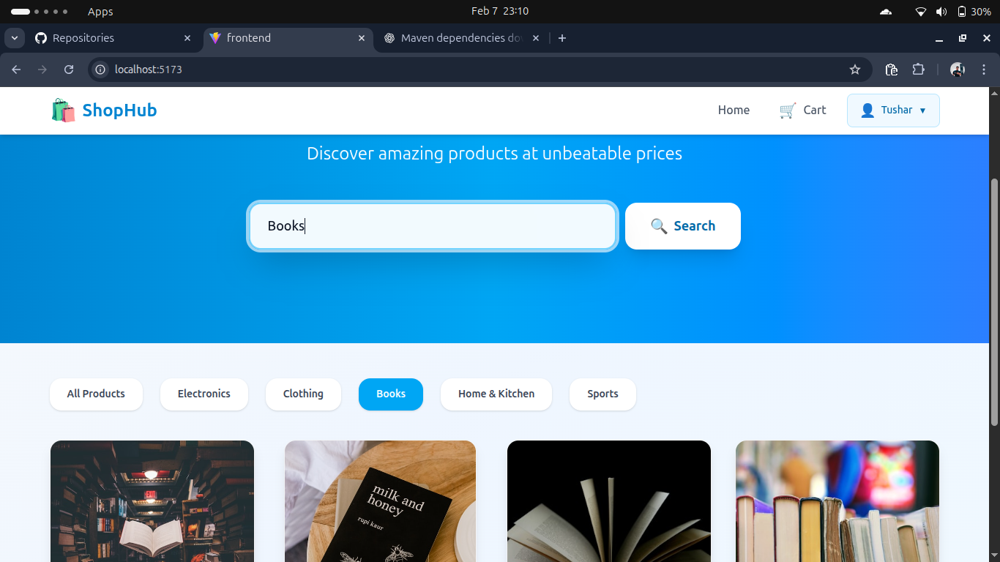

🛒 E-Commerce Shopping Website

This is a full-stack E-Commerce Shopping Website developed to provide users with a smooth and modern online shopping experience.

🚀 Project Overview

The project allows users to:

Browse products

Filter products by category

Search for products

Screenshots:

View product details

Place orders

The application is built using modern web technologies with a clear separation between frontend and backend.

🧑‍💻 Tech Stack
🔹 Backend

Java

Spring Boot

Spring Data JPA

Spring Security (JWT – if applicable)

REST APIs

🔹 Frontend

React.js

Tailwind CSS

Axios

Vite

🔹 Database

PostgreSQL

✨ Features

Product listing

Category-based product filtering

Product search functionality

Responsive and modern UI

RESTful API integration

Secure backend architecture

Clean and reusable frontend components

🗂️ Project Structure
Ecommerce Project
│
├── backend (Spring Boot)
│   ├── Controllers
│   ├── Services
│   ├── Repositories
│   └── Entities
│
├── frontend (React)
│   ├── Components
│   ├── Pages
│   ├── Services (API calls)
│   └── UI with Tailwind CSS

⚙️ Setup Instructions
Backend

Install Java 17

Install PostgreSQL

Configure database in application.properties

Run:

mvn spring-boot:run

Frontend

Install Node.js

Navigate to frontend folder

Run:

npm install
npm run dev

📌 Future Enhancements

User authentication & authorization

Shopping cart functionality

Payment gateway integration

Admin dashboard

Order tracking

👤 Author

Tushar Ruhela
Full Stack Developer (Java | Spring Boot | React)